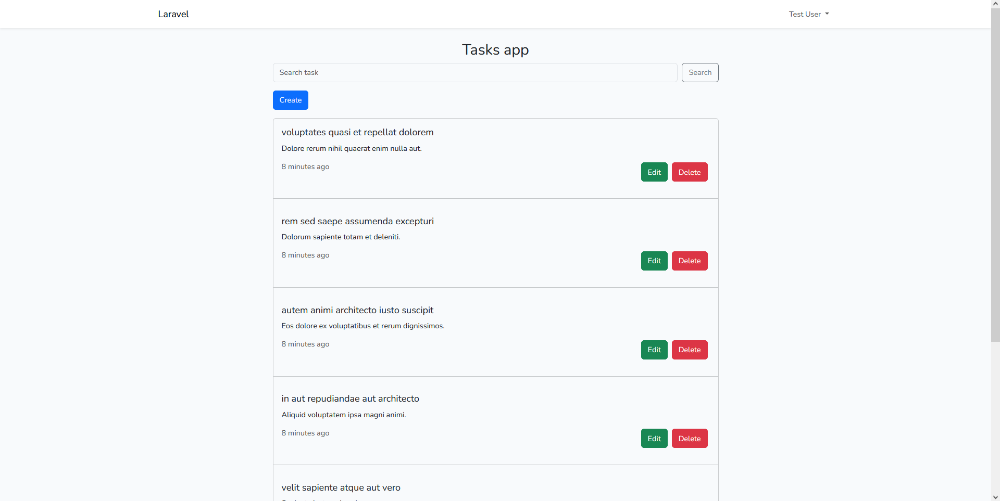
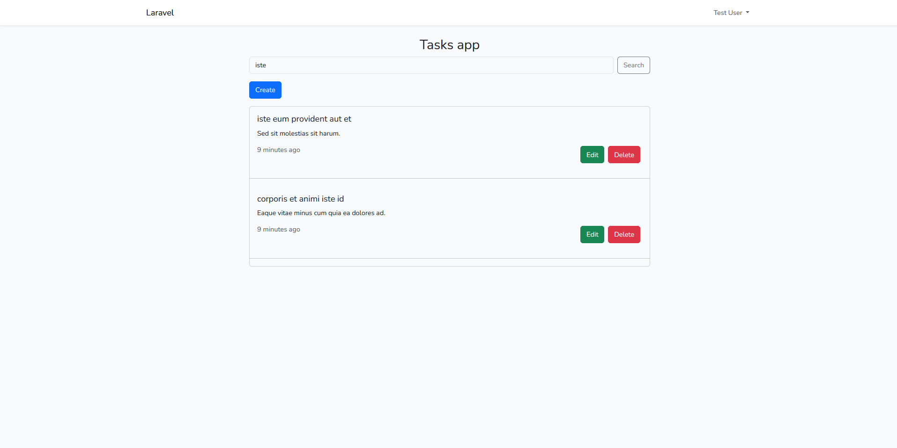
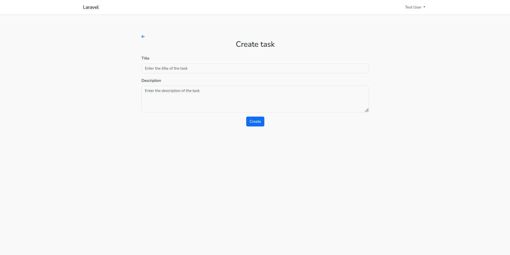
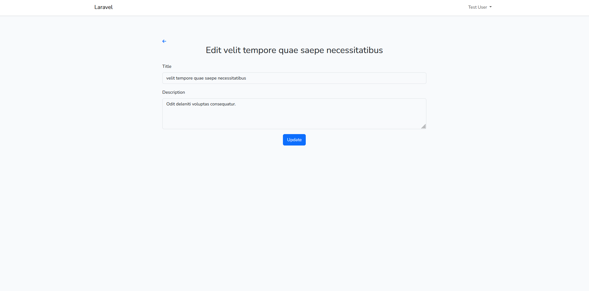
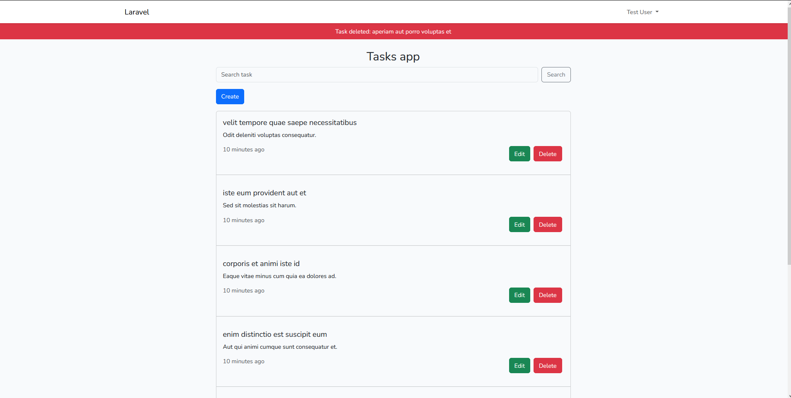
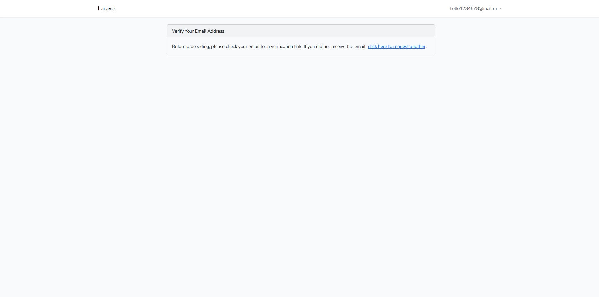
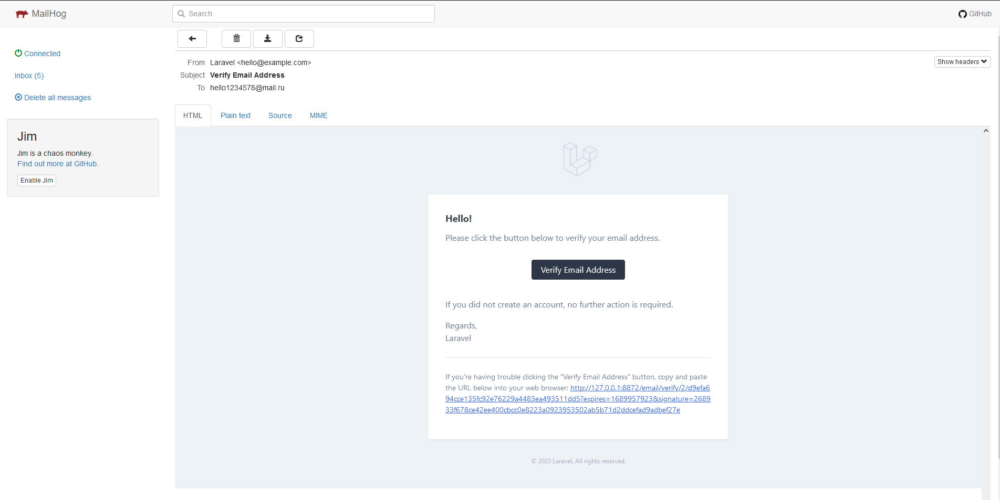
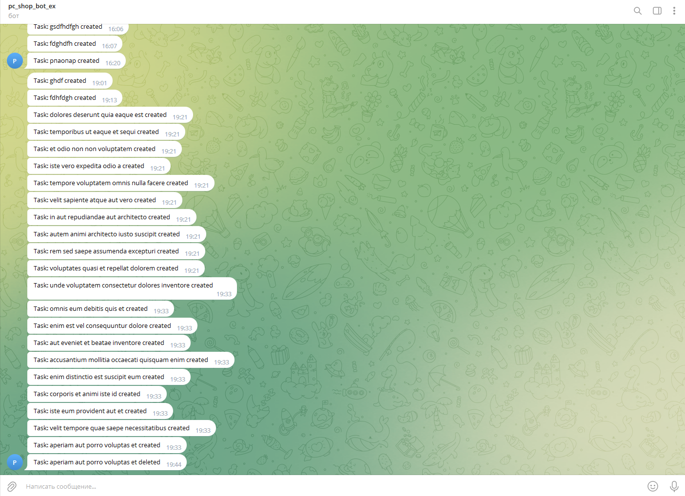

# Laravel Todo

### Installation

Setting up your development environment on your local machine :

- git clone https://github.com/sodaler/lar_todo.git
- cd lar_todo
- cp .env.example .env
- composer install
- npm install
- docker-compose up -d

---

### Before starting
You need to:  

Enter the app container:

- docker exec -it lar_todo_app bash

Run the migrations with queue listen:

- php artisan todo:install

Refresh database with seeds:

- php artisan todo:refresh

Configure env:

- Set smtp server settings
- Set telegram chat_id, token

Configure tests db:

- docker exec -it lar_todo_app bash
- php artisan make:migration --env testing
- php artisan test

### Tests user information after seeds

- email: test@example.com
- password: example123

---

### Some Screenshots

### Todo

### Email verification

### Telegram notifications

